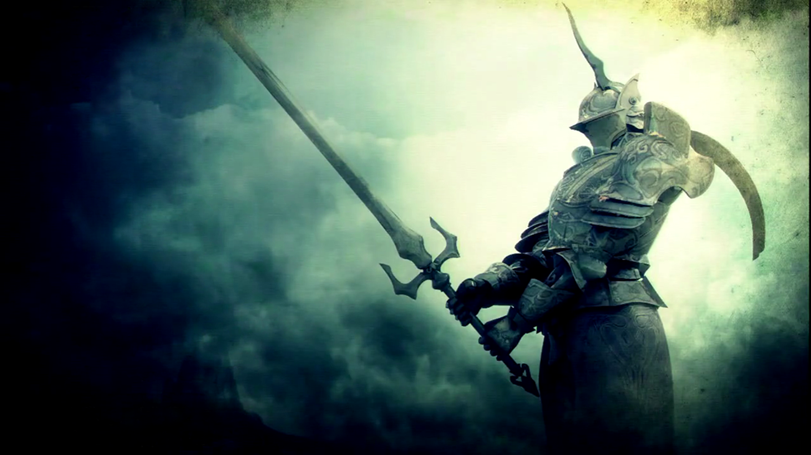

# Escape from Hospital

> Juego de terror en primera persona — UTN FRBA · Técnicas de Gráficos por Computadora

<p align="center">
  
</p>

Inspirado en **Amnesia**, **Outlast** y **Penumbra**: el jugador despierta en un hospital abandonado y debe escapar evadiendo a un boss con inteligencia artificial, resolviendo puzzles y administrando recursos (pilas, llaves, fluorescentes).

---

## Gameplay

| Sistema | Descripción |
|---------|-------------|
| 🎮 Cámara FPS | Primera persona con movimiento libre por el hospital |
| 👁️ Boss IA | Patrulla el mapa con Dijkstra; persigue y ataca al detectar al jugador |
| 🔦 Iluminadores | Linterna, faroles y fluorescentes — cada uno consume batería |
| 🗺️ Inventario | Recolectá llaves, pilas y el mapa del hospital |
| ⚠️ Efectos | Post-procesado de alarma y distorsión en situaciones de peligro |

### Pantallas del juego

<p align="center">
  
  &nbsp;&nbsp;
  
</p>

<p align="center">
  
  &nbsp;&nbsp;
  
</p>

---

## Controles

| Teclado / Mouse | Mando Xbox | Acción |
|----------------|------------|--------|
| W / A / S / D | Stick izquierdo | Moverse |
| Mouse | Stick derecho | Mirar |
| Click izquierdo | Botón X | Encender/apagar luz principal |
| Click derecho | Botón Y | Cambiar a luz fluorescente |
| F | LB | Siguiente iluminador |
| E | Botón A | Interactuar |
| Q | Back | Abrir inventario |
| Shift | Botón B | Agacharse |
| P | Start | Pausar |
| RB | — | Defenderse con fluor |

---

## Requisitos

- **Windows** (x86 / x64)
- [Microsoft .NET Framework 4.8](https://dotnet.microsoft.com/download/dotnet-framework/net48)
- [SharpDX 4.2.0](https://www.nuget.org/packages/SharpDX/) — instalado automáticamente vía NuGet

## Compilar y ejecutar

```bash
# 1. Clonar el repositorio
git clone https://github.com/TU_USUARIO/TgcUtn-HorrorGame-GoldEd.git

# 2. Abrir en Visual Studio 2019/2022
# Abrir TgcViewer.sln

# 3. Build → HorrorGame en modo Release

# 4. Ejecutar HorrorGame.exe
```

### Verificar compilación localmente (macOS / Linux)

```bash
# Instalar dotnet SDK (si no está instalado)
brew install dotnet

# Verificar que compila sin errores
./build-local.sh
```

---

## Estructura del proyecto

```
TgcViewer/           → Engine (WinForms + SharpDX.Direct3D9)
Examples/            → Demos y ejemplos del framework
AlumnoEjemplos/
  LOS_IMPROVISADOS/  → Código fuente del juego
  Media/             → Assets (modelos, texturas, audio, shaders)
HorrorGame/          → Launcher standalone (HorrorGame.exe)
```

### Sistemas del juego

```
EjemploAlumno.cs          → Entry point y game loop
Mapa/                     → Carga y gestión de la escena XML
Personajes/               → Jugador, Boss con IA (Dijkstra + estados)
Iluminadores/             → Sistema de linternas/faroles con batería
EfectosPosProcesado/      → Alarma, distorsión, efecto escondido
Objetos/Inventario/       → Items, llaves, pilas
Menu/                     → Menú principal, pausa, configuración
InputManager.cs           → Abstracción teclado+mouse+mando
```

---

## CI / CD

Cada push a `main` dispara un build check en GitHub Actions (Linux, docker). Las releases con tag `v*` generan automáticamente un ZIP descargable con el juego completo.

[](https://github.com/TU_USUARIO/TgcUtn-HorrorGame-GoldEd/actions/workflows/build.yml)

---

## Equipo

**Los Improvisados** — UTN FRBA, Técnicas de Gráficos por Computadora (2016)
